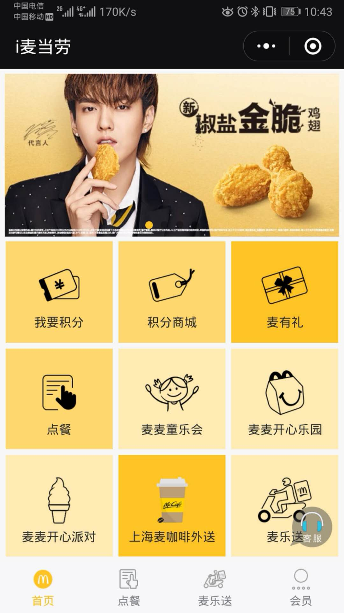
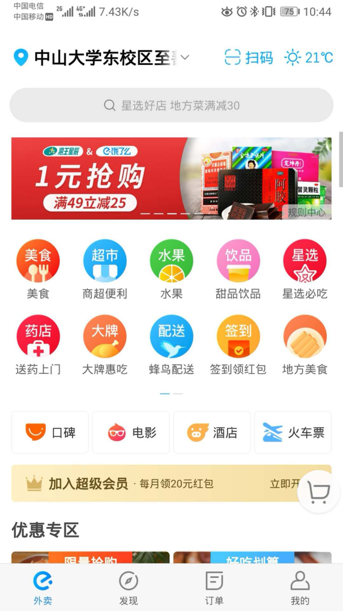

# 3 Investigation（项目前期调研）

### 1) 选题方向

#### 1.1 研究目的

调查当前年轻人对于点餐软件的使用情况，设计一种适用于小餐店的点餐程序，并且对国内市场上常见的点餐相关的软件应用进行竞品分析，确定必须功能与吸引用户的特点

#### 1.2.市场现状

如今的快速都市生活导致年轻人越来越少自己做菜，特别是午餐更倾向于比较方便的单位附近的小店吃午餐，某些有着良好口碑热门小店往往需要排队点餐与付款，那么如果有一款适合小餐厅的点餐与支付软件，可以解决这些小店由于服务员少而导致的服务不及时的问题。

#### 1.3.目标人群

主要对象为有消费能力年轻人群，熟悉使用智能手机，倾向于移动支付，家与单位较远，平时外出吃饭。

### 2) 竞品分析

#### 2.1 竞品选择

我们小组选择了麦当劳的i麦当劳和饿了么
点餐软件进行分析，因为该软件的使用人群十分庞大，知名度高，软件完成度高。

#### 2.2 竞品分析

**i麦当劳**  
  
目标人群：喜欢麦丹劳并且倾向于移动支付的人群  
产品定位：微信小程序   
设计特点：功能齐全，有丰富的附加功能。   
产品优劣：   
优点：功能丰富，界面风格与麦丹劳主题风格一致。   
缺点：未能突出点餐的主要功能，进入点餐系统要进入另一个小程序。   

**饿了么**   
  
目标人群：不想出去吃饭又不想自己做饭并且倾向于移动支付的人群   
产品定位：手机app   
设计特点：外卖点餐，推荐用户感兴趣的商家。   
产品优劣：   
优点：功能丰富，简单上手。   
缺点：程序外观不能突出主题，app图标与支付宝过于相似。   
   
#### 2.3 竞品启发   
产品理念：产品应突出自身核心功能，功能全面，界面明了，突出主体。   
产品架构：采用标准化设计，保持与系统架构的统一   
产品视觉：使用和谐色调并且突出主体。   
产品交互：首页主功能突出，注意细节的简洁与详略之分，同时避免功能冲突。   
   
# 3 总结   
产品的第一目标是满足用户的需求，点餐系统的第一大需求就是简单方便的点餐然后支付，所以我们的产品应该要突出这个功能，并且对新手用户有指导功能，方便用户上手。产品UI风格要简洁大方，突出点餐功能。   
