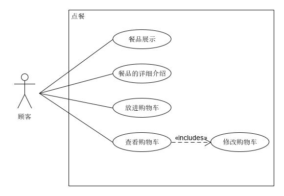
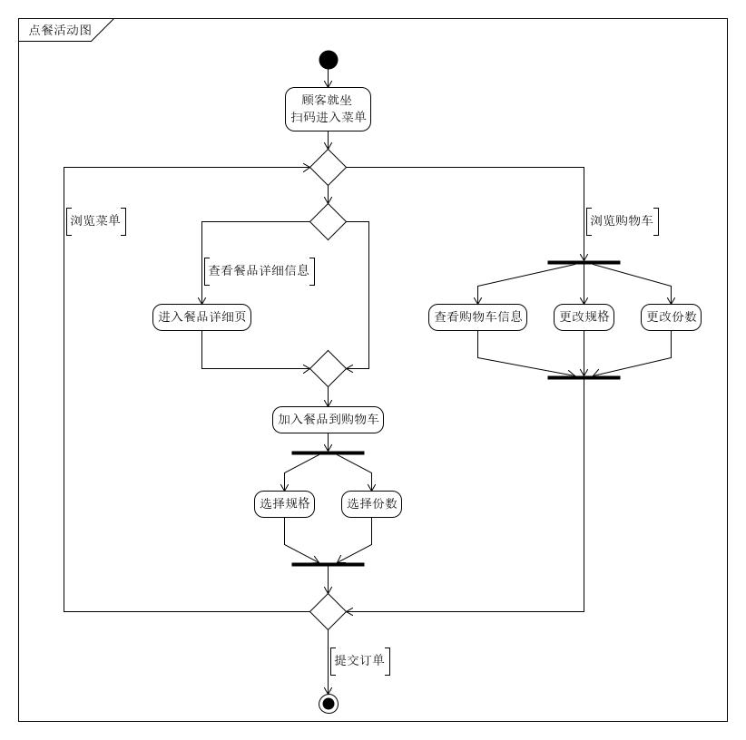
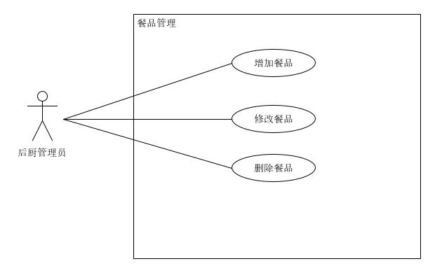
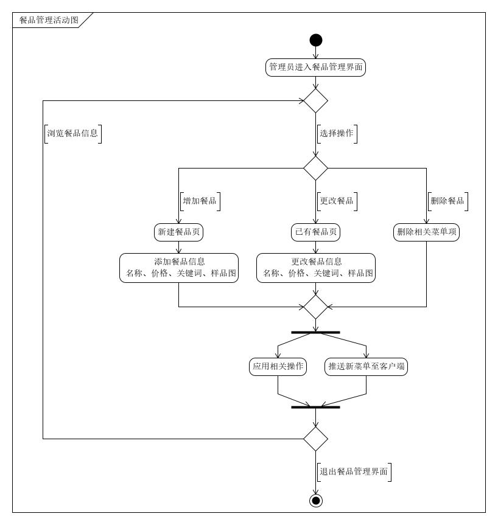
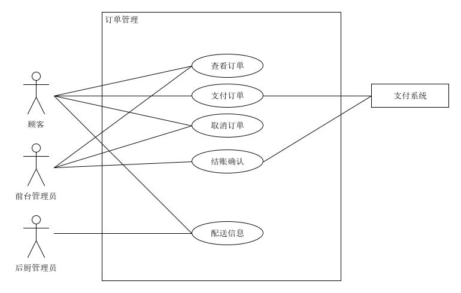
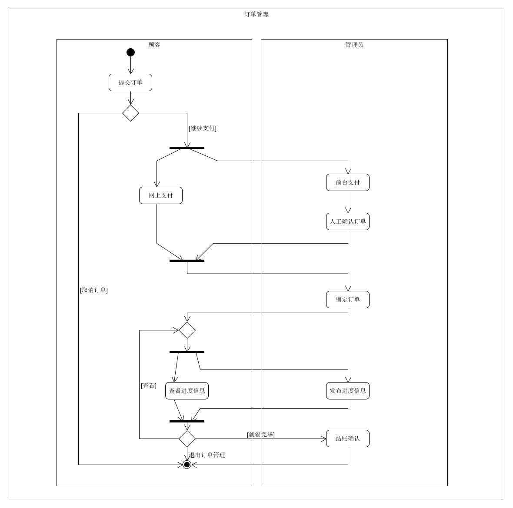

# 用例+活动图

## 1. 顾客点餐用例

| 版本 |   日期    | 描述 |  作者   |
| :--: | :-------: | :--: | :-----: |
| v1.0 | 2019-1-15 | 草案 | godsome |

### 用例图

### 范围

客户端

### 级别

用户目标

### 主要参与者

顾客

### 涉众及关注点

顾客：能够通过扫码进入点餐界面，希望便捷地看到店内的可点餐品，能够进一步查看餐品的详细信息和加入购物车，加入购物车时能够同时确定餐品规格及份数，能够看到实时累记的价格，在餐品加入购物车后，能够对餐品的规格进行更改，能够对份数进行增、删。

### 前置条件

顾客已就位并通过扫码进入点餐界面

### 后置条件

提交订单信息

### 主成功场景

1. 参与点餐的顾客就坐，并扫码
2. 在浏览界面查看餐品，可进一步查看餐品详细信息
3. 选择菜式，规格，份数，加入购物车，可实时查看消费金额
4. 可以通过购物车对菜式规格、份数进行更改
5. 提交订单

### 扩展

1. 顾客点餐时意外退出小程序
   - 系统保存当前点餐信息
   - 顾客重新进入时，可恢复之前信息
2. 顾客选择了库存不足的餐品
   - 告知该餐品无食材并致歉
3. 现金支付
   - 前台支付收取金额

### 活动图

## 2. 餐品管理用例

| 版本 |   日期    | 描述 |  作者   |
| :--: | :-------: | :--: | :-----: |
| v1.0 | 2019-1-15 | 草案 | godsome |

### 用例图

### 范围

后台管理端

### 级别

子系统

### 主要参与者

管理员

### 涉众及关注点

顾客：能够查看餐品信息，能够在点到无库存的菜式时得到提示

管理员：能够添加新的餐品，能够对已有的餐品信息进行更新，能够删除不再提供的餐品信息

### 前置条件

管理员进入餐品管理界面

### 后置条件

向客户端发送新的餐品信息

### 主成功场景

1. 管理员进入餐品管理界面
2. - 选择增加餐品，进入新的子界面，能够对餐品的名称，价格，关键词，详细信息，样品图进行编辑
   - 选择修改餐品，弹出与增加餐品相同的界面，不过此处只是对信息进行更新，不会产生新的条目
   - 选择删除餐品，弹出警告，由管理员确认是否删除
3. 增加、修改、删除餐品后，向客户端发送新的餐品列表

### 扩展

1. 餐厅可以自己选择向用户展示什么餐品，不需要过多的编辑
   - 维护一个总的餐品列表
   - 用户可以对这个列表进行增、删、查、改
   - 用户可以通过对列表项的选择来确定向客户端推送餐品信息
2. 餐厅希望对餐品进行更多样的管理
   - 能够对向客户展示的界面显示推荐餐品，热销餐品，餐品分类
   - 添加打折服务，提供满减服务

### 活动图

## 3. 订单管理用例

| 版本 |   日期    | 描述 |  作者   |
| :--: | :-------: | :--: | :-----: |
| v1.0 | 2019-1-15 | 草案 | godsome |

### 用例图

### 范围

客户端，后台管理端

### 级别

子系统

### 主要参与者

顾客、管理员

### 涉众及关注点

顾客：能够查看订单信息，订单信息包括流水号，消费金额，消费日期，消费餐品信息；能够对未支付的订单进行支付或取消；能够查看某订单的进度信息，包括是否完成订单，已上餐品的信息

管理员：能够查看订单信息，编辑订单进度信息，对订单结账信息进行确认，确认包括顾客网上支付和前台支付形式

### 前置条件

顾客提交订单

### 后置条件

后台确认结账信息，重置餐桌就餐状态

### 主成功场景

1. 用户提交订单
2. 
   - 未支付，顾客可以取消订单，或通过网上支付、现金支付的方式确认订单；管理员对长时间未付款订单进行取消
   - 已支付，锁定订单
3. 管理员可查看未支付订单，若顾客现金支付，手动确认订单；对于已支付订单，开始进行配菜，并添加进度信息
4. 顾客可以查看订单配菜进度信息
5. 顾客用餐完毕后，后台进行结账确认，重置该餐位就餐信息

### 扩展

1. 顾客感觉配餐进度慢
   - 可以通过订单界面进行催促
2. 顾客不想网上支付
   - 提醒可前台现金支付

### 活动图

