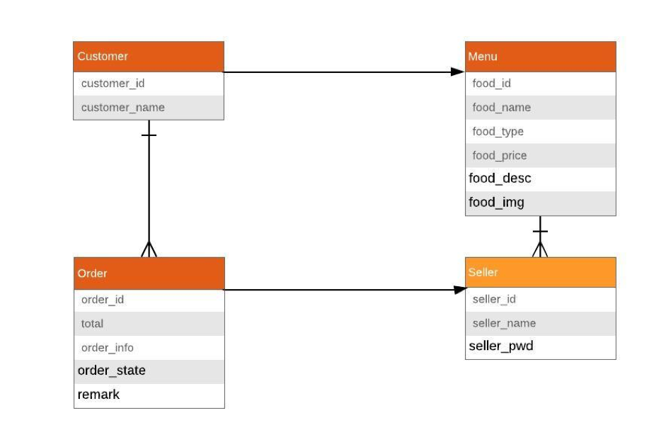

## 用户及权限系统数据库设计
Customer

| Field         | Type        | Key | Description          |
|---------------|-------------|-----|----------------------|
| customer_id   | int         | PRI | The ID of customer   |
| customer_name | varchar(20) |     | The name of customer |

Seller

| Field       | Type        | Key | Description            |
|-------------|-------------|-----|------------------------|
| seller_id   | int         | PRI | The ID of seller       |
| seller_name | varchar(20) |     | The name of seller     |
| seller_pwd  | varchar(20) |     | The password of seller |

Order

| Field       | Type         | Key | Description              |
|-------------|--------------|-----|--------------------------|
| order_id    | int          | PRI | The ID of order          |
| total       | float        |     | The total price of order |
| order_info  | varchar(500) |     | The information of order |
| order_state | varchar(10)  |     | The state of order       |
| remark      | varchar(500) |     | The remark of order      |

Menu

| Field      | Type         | Key | Description               |
|------------|--------------|-----|---------------------------|
| food_id    | int          | PRI | The ID of food            |
| food_name  | varchar(20)  |     | The name of food          |
| food_type  | varchar(20)  |     | The type of food          |
| food_price | float        |     | The price of food         |
| food_desc  | varchar(100) |     | The description of food   |
| food_img   | varchar(100) |     | The address of food image |

Ordering

| Field      | Type         | Key | Description               |
|------------|--------------|-----|---------------------------|
| food_id    | int          | PRI | The ID of food            |
| food_name  | varchar(20)  |     | The name of food          |
| food_type  | varchar(20)  |     | The type of food          |
| food_price | float        |     | The price of food         |
| food_desc  | varchar(100) |     | The description of food   |
| food_img   | varchar(100) |     | The address of food image |

Select

| Field       | Type | Key | Description                 |
|-------------|------|-----|-----------------------------|
| customer_id | int  | PRI | The ID of customer          |
| food_id     | int  |     | The ID of food              |
| food_num    | int  |     | The number of selected food |

Manager

| Field     | Type | Key | Description      |
|-----------|------|-----|------------------|
| seller_id | int  | PRI | The ID of seller |
| food_id   | int  |     | The ID of food   |

## ER Diagram:

