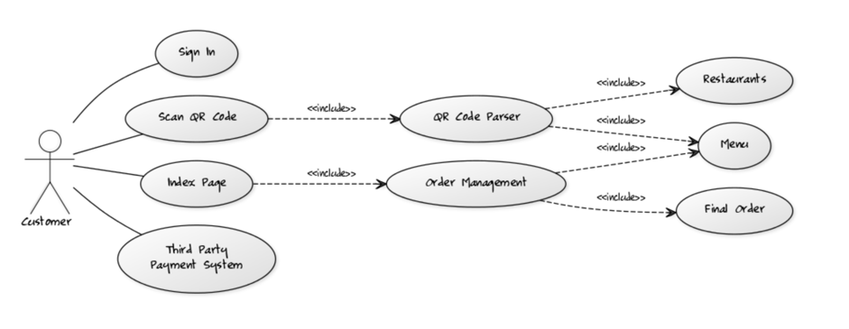
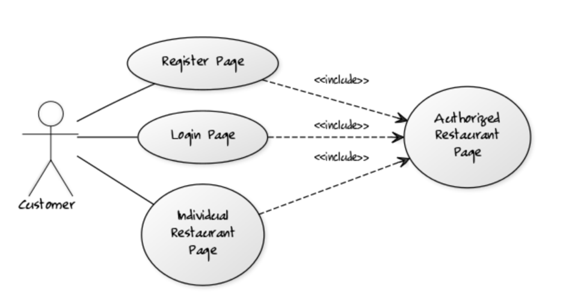
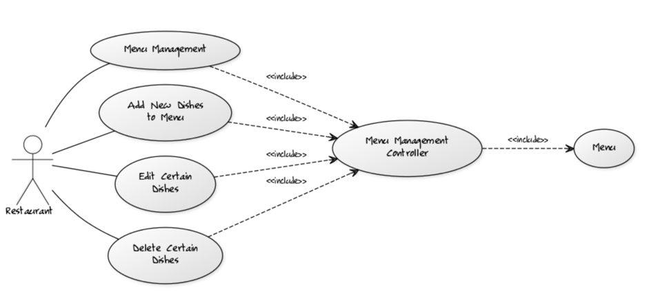

#  Use Case Design
##  Order Use Case:

Code: [Customer]-(Sign In), [Customer]-(Scan QR Code), [Customer]-(Index Page), [Customer]-(Third Party Payment System), (Index Page)>(Order Management), (Scan QR Code)>(QR Code Parser), (QR Code Parser)>(Restaurants), (QR Code Parser)>(Menu), (Order Management)>(Menu), (Order Management)>(Final Order)

##  Register and Sign-In Use Case:

Code: [Customer]-(Register Page), [Customer]-(Login Page), [Customer]-(Individual Restaurant Page), (Register Page)>(Authorized Restaurant Page), (Login Page)>(Authorized Restaurant Page), (Individual Restaurant Page)>(Authorized Restaurant Page)

##  Menu Management Use Case:

Code: [Restaurant]-(Menu Management), [Restaurant]-(Add New Dishes to Menu), [Restaurant]-(Edit Certain Dishes), [Restaurant]-(Delete Certain Dishes), (Menu Management)>(Menu Management Controller), (Add New Dishes to Menu)>(Menu Management Controller), (Edit Certain Dishes)>(Menu Management Controller), (Delete Certain Dishes)>(Menu Management Controller), (Menu Management Controller)>(Menu)
